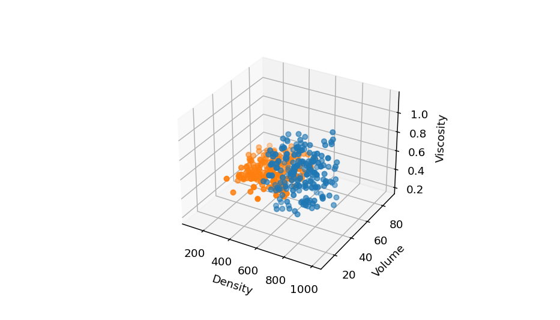
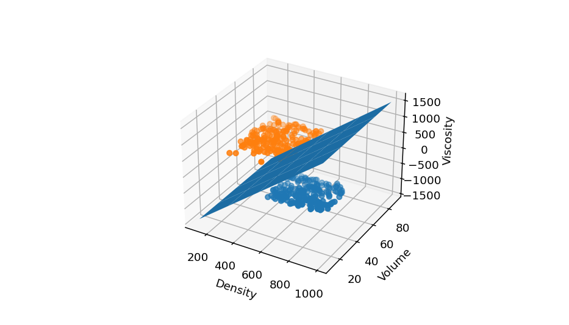

# SVM-example-for-medium-article

This repository contains code that visualizes the decision boundary of a support vector machine model on a 3-D dataset. It is meant to be a supplement to the related medium article.

## Dataset

## Dataset with Decision Boundary

